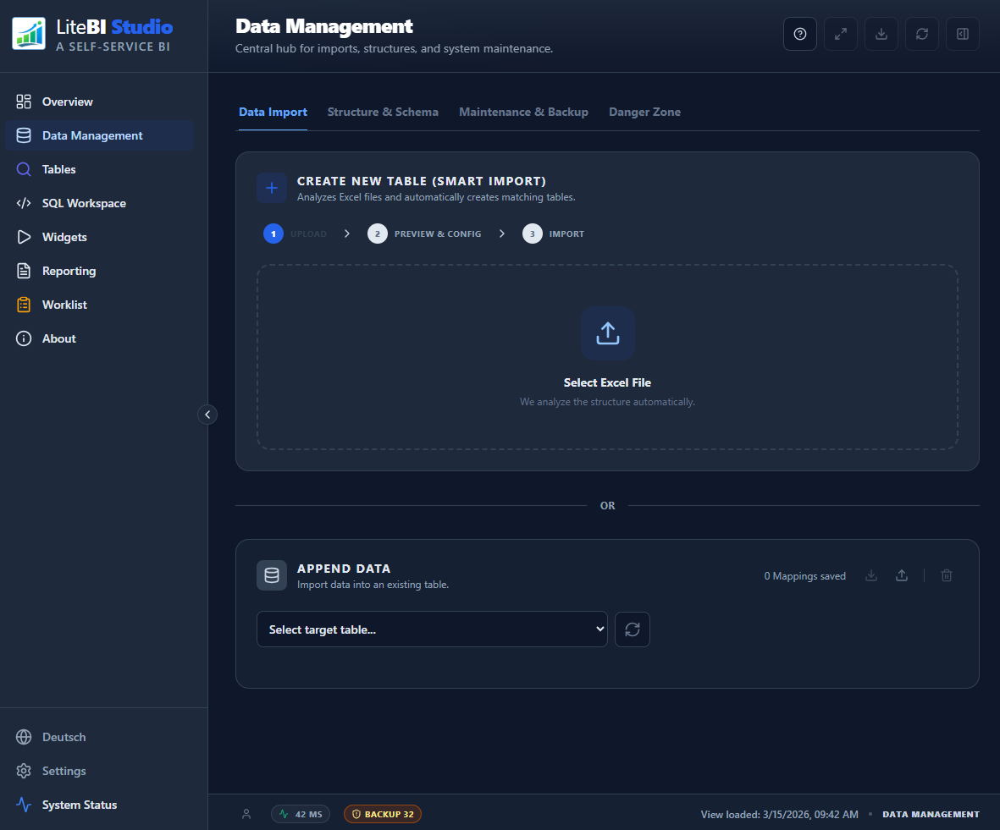
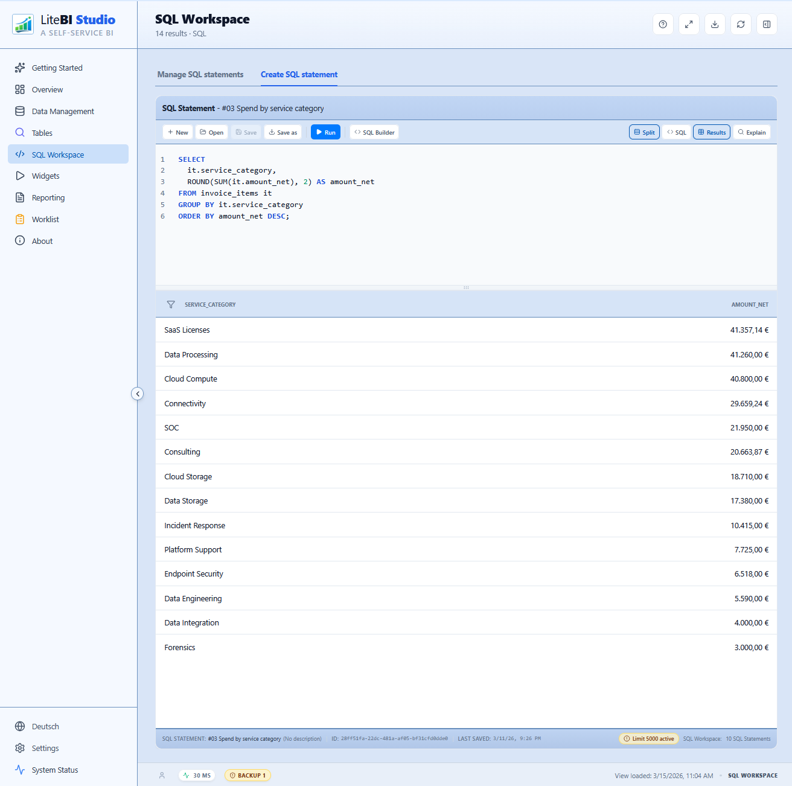
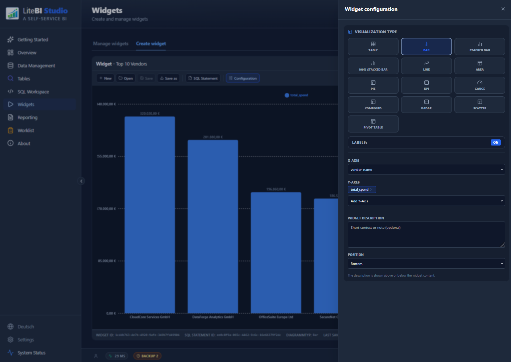
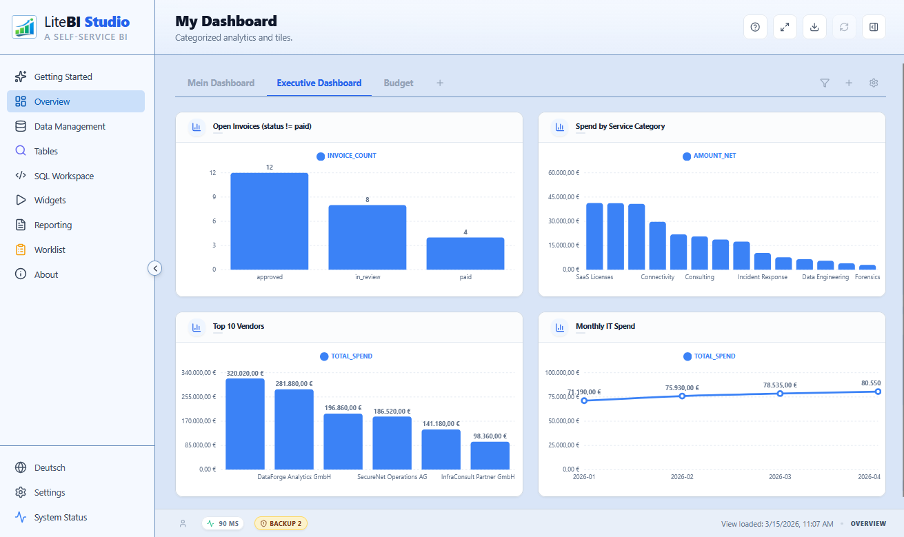

# LiteBI Studio


Local-first BI and reporting for privacy-sensitive analytics.

LiteBI Studio is a browser-based workspace for importing, modeling, analyzing, and presenting data without a backend.

It combines Excel import, SQL-based analysis, configurable widgets, dashboards, and report exports in a zero-backend architecture built on SQLite WASM. Your data stays on your machine. No telemetry, no server component, no external data calls during normal usage.

[Live Demo](https://hrmnns.github.io/litebistudio/) | [Getting Started](docs/wiki/Getting-Started.md) | [Wiki](docs/wiki/Home.md) | [Example: Cherit IT Invoice Control](docs/wiki/Example-Cherit-IT-Invoice-Control.md)


## Why LiteBI Studio?

- Local-first by design: data is processed and stored in the browser with SQLite WASM + OPFS.
- No backend required: the app can be hosted statically, including on GitHub Pages.
- Built for controlled environments: suitable for IT controlling, internal reporting, demos, and privacy-sensitive analysis.
- End-to-end workflow in one tool: import, inspect, query, visualize, assemble dashboards, and export reports.
- Flexible data model: works with generic relational structures instead of forcing one business schema.

## Use Cases

- IT controlling: analyze invoices, budgets, vendors, cost centers, and operational KPIs locally.
- Internal reporting: build dashboards and export management-ready report packs without standing up backend infrastructure.
- Proof of concept work: validate data models, SQL logic, and reporting flows quickly with a static deployment.
- Regulated or privacy-sensitive scenarios: keep source files and derived datasets on-device.
- Demo and training environments: load prepared examples and walk through realistic end-to-end workflows.

## What You Can Do

### Analyze Data

- Import Excel data with schema-aware helper flows.
- Inspect tables and views directly in the browser.
- Maintain optional schema documentation for tables, views, columns, and relationships.
- Validate, clean up, export, and import schema metadata without exposing row-level data.
- Build SQL statements in a dedicated SQL editor and preview results immediately.
- Use reusable SQL statements as the basis for widgets and dashboards.

### Build Visuals

- Create widgets for tables, KPI tiles, bar/line/area/pie/radar/scatter charts, gauges, pivot tables, and rich text content.
- Configure axes, series, labels, colors, thresholds, and widget descriptions.
- Assemble multiple widgets into dashboards with drag-and-drop layout management.

### Package Results

- Build multi-page report packs from dashboards and widgets.
- Export outputs as PDF, image, HTML, JSON, and PPT where supported.
- Use example datasets and guided flows to evaluate the app quickly.

### Stay Local and Secure

- Keep data on-device with no mandatory cloud dependency.
- Use app lock protection and encrypted backups.
- Benefit from CSP hardening and a zero-telemetry operating model.

## Typical Workflow

1. Import an Excel file in `Data Management`.
2. Optionally enrich the schema with semantic documentation in `Structure & Schema`.
3. Explore the loaded tables in `Tables`.
4. Create or refine queries in `SQL Workspace`.
5. Turn query results into visuals in `Widgets`.
6. Arrange widgets into a dashboard.
7. Export a report pack or share results as a local artifact.

## Product Tour

### Data import and preparation



### SQL analysis workspace



### Widget and dashboard creation





## Try It Quickly

### Live Demo

Open the hosted version:

- https://hrmnns.github.io/litebistudio/

Fastest evaluation path:

1. Open the app.
2. Go to `Data Management`.
3. Import an Excel file or restore the prepared example backup.

Detailed walkthroughs:

- [Getting Started](docs/wiki/Getting-Started.md)
- [Example: Cherit IT Invoice Control](docs/wiki/Example-Cherit-IT-Invoice-Control.md)
- [Examples](docs/wiki/Examples.md)

Privacy note:

- Your data stays local in your browser.
- Normal app usage does not upload your datasets to an external server.

## Local Development

### Prerequisites

- Node.js 20.x or later
- npm

### Install and Run

```bash
git clone https://github.com/hrmnns/litebistudio.git
cd litebistudio
npm install
npm run dev
```

Optional once per clone:

```bash
npm run hooks:install
```

This activates the repository git hooks from `.githooks/` so `build` and `test` run automatically on push.

### Build

```bash
npm run build
```

### Local Quality Gates

```bash
npm run lint
npm run check:i18n
npm run check:encoding
npm run build
npm run test
```

## Architecture Overview

LiteBI Studio follows a local analytics pipeline:

1. `Sources`
   Excel files and local example datasets enter the app through browser-based import flows.
2. `Ingest`
   Data is read, mapped, and validated before being persisted.
3. `Storage`
   SQLite WASM stores tables, views, and derived structures in browser storage.
4. `Analytics`
   SQL statements, saved queries, and widget configurations build reusable analysis layers.
5. `UI`
   Widgets, dashboards, and report packs present the results.

Important technical characteristics:

- Frontend: React 19 + TypeScript + Vite
- Styling: Tailwind CSS
- Database: SQLite WASM + OPFS
- Charts: Recharts
- i18n: i18next (`DE` / `EN`)
- Export stack: `html2canvas` + `jsPDF`

## Documentation

The repository wiki source lives in `docs/wiki/`.

Recommended starting points:

- [Wiki Home](docs/wiki/Home.md)
- [Getting Started](docs/wiki/Getting-Started.md)
- [Examples](docs/wiki/Examples.md)
- [Architecture](docs/wiki/Architecture.md)
- [Page: Data Management](docs/wiki/Page-Data-Management.md)
- [Page: SQL Workspace](docs/wiki/Page-SQL-Workspace.md)
- [Page: Widgets](docs/wiki/Page-Widgets.md)
- [Page: Dashboard](docs/wiki/Page-Dashboard.md)
- [Security and Privacy](docs/wiki/Security-and-Privacy.md)

The GitHub Wiki is synchronized from the repository through `.github/workflows/wiki-sync.yml`.

## Project Structure

- `src/app/` UI views, widgets, layout, and page-specific logic
- `src/components/` shared UI building blocks
- `src/hooks/` reusable hooks for async state, local storage, export, and app behavior
- `src/lib/` repositories, DB integration, security utilities, app state, and infrastructure
- `src/locales/` translation files for German and English
- `src/datasets/` schema and dataset-related SQL
- `docs/wiki/` user and maintainer documentation
- `scripts/` repository maintenance and validation scripts

## Deployment

LiteBI Studio is optimized for static hosting.

- `npm run build` produces the production bundle in `dist/`.
- The app uses `coi-serviceworker.js` so SharedArrayBuffer/OPFS features can work on GitHub Pages without custom server headers.
- If OPFS is unavailable, the app falls back gracefully to in-memory database behavior.

## Security and Privacy

- No external tracking or telemetry
- No mandatory server component
- Data sovereignty through local browser storage and local file import/export
- CSP restrictions to limit unauthorized outbound connections
- App lock with salted protection
- AES-GCM encrypted backups

## CI, Releases, and Changelog

- CI workflow: `.github/workflows/ci.yml`
- Wiki sync workflow: `.github/workflows/wiki-sync.yml`
- Release history: [CHANGELOG.md](CHANGELOG.md)
- Versioning: [Semantic Versioning](https://semver.org/)

Recommended branch protection:

- require `CI / quality-gates (pull_request)` before merging into `main`

## What LiteBI Studio Is Not

- Not a hosted SaaS BI platform
- Not a multi-user server application
- Not dependent on a cloud warehouse or external API backend

That tradeoff is intentional: LiteBI Studio prioritizes local control, portability, and privacy over centralized orchestration.

---

Built for local analytics, data sovereignty, and fast insight loops.
