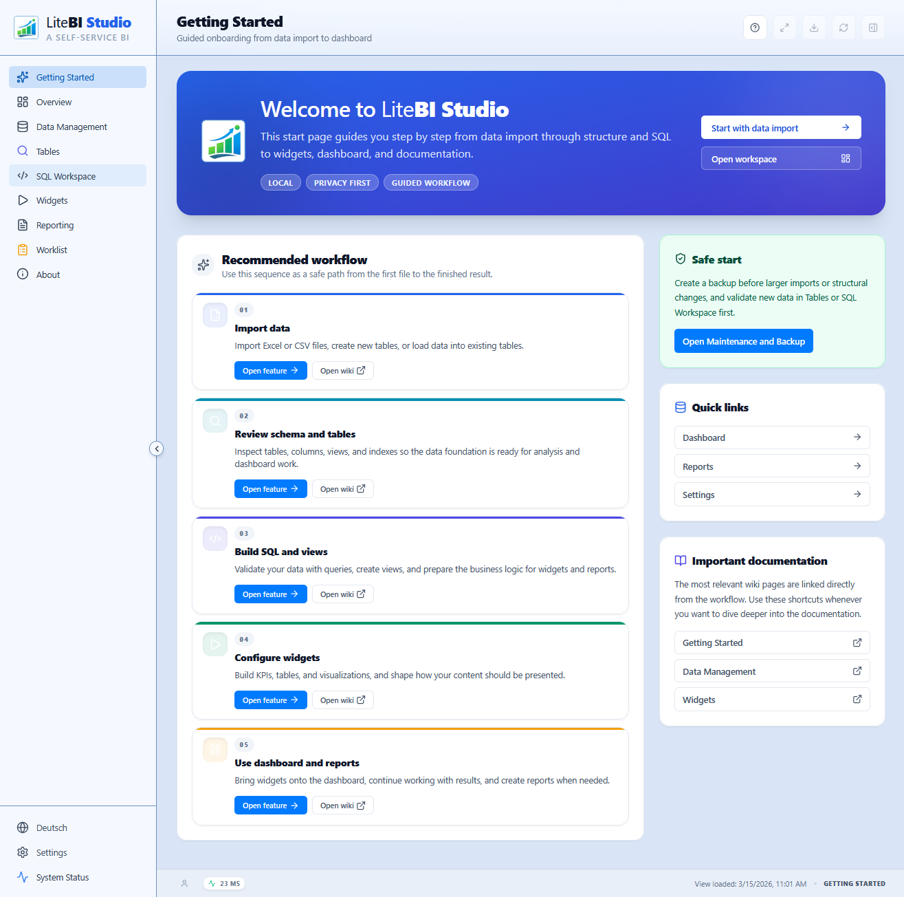

# Getting Started

_Last updated: 2026-03-15_

## Try Instantly (No Installation)

You can use LiteBI Studio directly in your browser without installing anything:

- https://hrmnns.github.io/litebistudio/



Fastest path to first value:

1. Open the URL.
2. Go to **Data Management**.
3. Start with **Excel import** and load your first dataset.

This is the recommended entry point for new users who want to evaluate the tool quickly.

Alternative fast start with a ready-to-use example backup:

- Open **Data Management**
- Navigate to **Maintenance & Backup**
- Select **Restore backup**
- In the **Open File** dialog, you can enter this URL directly in the **File name** field:
  <https://github.com/hrmnns/litebistudio/releases/download/v1.8.0/litebistudio-example-cherit-it-invoice-control.v02.sqlite3>
- This loads a fully prepared example database without a separate manual download step

If your browser, operating system, or file dialog does not support this shortcut, download the `.sqlite3` file once and select it locally instead.

If you use this shortcut, the detailed walkthrough of the included example is documented here:

- [Example: Cherit IT Invoice Control](Example-Cherit-IT-Invoice-Control)

Privacy note:

- Your data stays local in your browser.
- No dataset is uploaded to an external server during normal app usage.

## Prerequisites

- Node.js 20.x or later
- npm

## Local Development

```bash
npm install
npm run dev
```

Optional (recommended once per clone):

```bash
npm run hooks:install
```

This enables the repository git hooks (`.githooks/`) so `build` and `test` run automatically on push.

## Local Quality Gates

```bash
npm run lint
npm run check:i18n
npm run check:encoding
npm run build
npm run test
```

## Quick Verification Paths

### UI smoke path

1. Open `Tables`
2. Open `SQL Workspace`
3. Run a simple query (`SELECT 1`)
4. Confirm results are visible and export behaves correctly

### Widget smoke path

1. Open `Widgets`
2. Load an existing widget
3. Run query
4. Open configuration panel and verify graphic preview updates
5. Save and confirm dirty marker clears

## Example SQL Scope Clarification

The Cherit example contains **10 SQL statements** in:

- `docs/examples/cherit-systems-it-invoice-control/queries.sql` (`Q01` ... `Q10`)

This is correct:

- `Getting Started` is intentionally a fast onboarding path and does not execute all 10 statements.
- The full step-by-step usage of the example SQL catalog is documented in:
  - [Example: Cherit IT Invoice Control](Example-Cherit-IT-Invoice-Control)

## Naming Convention (Recommended)

- Queries: `Q01 - <name>`, `Q02 - <name>`, ...
- Widgets: `W01 - <name>`, `W02 - <name>`, ...

## Troubleshooting

- If build fails locally, run `npm ci` and retry quality gates in the same order.
- If tests fail only in CI, compare local node version and ensure you use Node 20.x.
- For OPFS/SQLite runtime issues, see [Operations Runbook](Operations-Runbook).

## Related

- [Architecture](Architecture)
- [SQL Workspace and Tables](SQL-Workspace-and-Tables)
- [Operations Runbook](Operations-Runbook)
- [Release Process](Release-Process)
