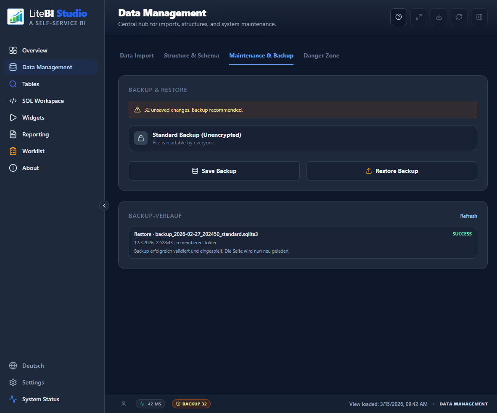
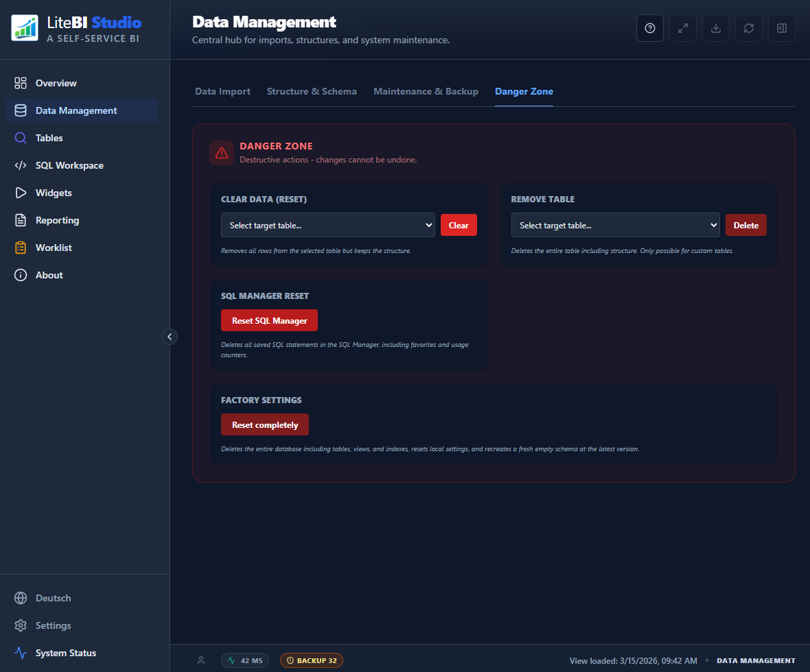

# Data Management

_Last updated: 2026-03-15_

## Purpose

Data Management is used to import, structure, and maintain your local database content.

## What You Can Do Here

- Import data from files
- Create or maintain tables and views
- Manage indexes and structural metadata
- Run maintenance and backup-related operations
- Use the `Danger Zone` for targeted or full reset operations

## How to Use It

1. Open `Data Management`.
2. Choose import or structure tasks based on your goal.
3. Validate schema and naming before applying changes.
4. Save and verify updates in `Tables` or `SQL Workspace`.

## Data Import

The `Import` tab provides two different import paths. Which one you should use depends on whether you want to create new tables from a file or import rows into an existing table.

### Import Path Overview

- `Smart Import`: creates one or more new tables from uploaded files
- `Append Data`: imports file content into an already existing target table

Both import flows accept spreadsheet-style source files such as `.xlsx`, `.xls`, and `.csv`.

### Smart Import for New Tables

Use `Smart Import` when the file should become one or more new user tables in the local database.

Typical use cases:

- Initial onboarding of external datasets
- Fast creation of staging or analysis tables
- Import of multiple sheets from one workbook as separate tables

How it works:

1. Open `Data Management > Import`.
2. In `Smart Import`, upload or drop an Excel/CSV file.
3. The app analyzes the workbook and creates a preview per detected sheet.
4. Review the proposed table names and column definitions.
5. Adjust table names where needed.
6. Start the import.

What Smart Import does:

- Reads the uploaded workbook or CSV file
- Detects tables from the available sheets
- Suggests table names automatically
- Applies the configured import prefix for user tables
- Prevents reserved `sys...` prefixes and falls back to `usr_` if needed
- Creates missing tables automatically
- Inserts the detected rows in chunks

Important behavior:

- If a target table name already exists, the import uses `CREATE TABLE IF NOT EXISTS`
- This means existing tables are not rebuilt automatically
- Smart Import is therefore best suited for new tables, not for controlled overwrite of existing production-like tables

### Append Data for Existing Tables

Use `Append Data` when the target table already exists and you want to import rows into that structure.

Typical use cases:

- Regular refresh of a known table
- Controlled import into a pre-defined schema
- Import with explicit column mapping and transformations

How it works:

1. Open `Data Management > Import`.
2. In the lower import section, select the target table.
3. Choose the import mode:
   `Append` adds new rows to the table.
   `Overwrite` clears the target table first and then imports the new rows.
4. Upload or drop the source file.
5. Review and confirm the column mapping if a schema is available.
6. Complete the import and verify the result in `Tables` or `SQL Workspace`.

### Mapping and Transformations

When importing into an existing table, LiteBI Studio can open a mapping dialog to align source columns with the target schema.

The mapping flow supports:

- Direct mapping from one source column to one target field
- Constant values
- Coalesce-style fallback between columns
- Concatenation of multiple source values
- Optional transformations for mapped values

This is useful when incoming files do not match the internal table structure exactly.

### Saved Mappings

The import area includes a mapping manager for reusable mappings.

- Saved mappings are stored locally in the browser
- They can be exported to JSON
- They can be imported again later
- They can be cleared if the mapping catalog should be rebuilt
- If `Auto-save mappings` is enabled, confirmed mappings are stored automatically for the current import target

This helps standardize recurring imports from the same source format.

### Append vs. Overwrite

Choose the import mode carefully:

- `Append`: keeps existing rows and adds the new imported rows
- `Overwrite`: deletes all rows in the selected target table before importing the new file

Use `Overwrite` only when the uploaded file is intended to fully replace the current content of that table.

### Recommended Import Procedure

1. Create a backup before importing important or high-volume data.
2. Decide whether you are creating a new table or importing into an existing one.
3. Use `Smart Import` for new tables and `Append Data` for existing tables.
4. Review table names, mapping, and import mode before executing.
5. Verify row counts and structure after the import.
6. Re-check widgets, reports, and SQL queries if the imported data is part of downstream analysis.

### Common Pitfalls

- Importing into the wrong target table
- Using `Overwrite` when rows should have been appended
- Reusing an old mapping after the source file structure changed
- Assuming Smart Import will safely remodel an already existing table
- Skipping a backup before a large or destructive import

If imports fail or the data afterwards looks inconsistent, see also [Troubleshooting: Storage and Recovery](Troubleshooting-Storage-and-Recovery).

## Maintenance & Backup

The `Maintenance & Backup` area is the operational safety net of LiteBI Studio. It should be used regularly, especially before imports, schema changes, restores, or destructive cleanup actions.

### What This Area Is For

- Create a full local backup of the current database state
- Optionally protect exported backups with password-based encryption
- Restore a previously exported backup into the current browser-local installation
- Review recent backup and restore events in the backup history

### Standard Backup

A standard backup exports the current local SQLite database as a file.

- Captures the complete current database state at the moment of export
- Suitable for routine operational backups and short rollback windows
- Can be downloaded through the browser or stored in a remembered backup folder if configured
- Should be created before large imports, table cleanup, SQL library cleanup, or factory reset

### Encrypted Backup

An encrypted backup adds password-based protection to the exported file.

- Recommended when backup files are stored outside a controlled local environment
- Uses a user-entered password during export and requires the same password again for restore
- Weak passwords trigger an additional warning before the export proceeds
- If the password is lost, the encrypted backup cannot be restored

For secure operations, use encrypted backups whenever backup files may be copied, shared, archived, or moved to external storage.

### Restore

Restore replaces the active local database with the selected backup content.

- Intended for recovery, rollback, test resets, or migration between local browser environments
- Checks the selected file before import and reports invalid or incompatible backups
- Supports both plain and encrypted backup files
- Can use the remembered backup folder or the regular file picker
- Reloads the app after a successful restore so all modules work with the restored state

Because restore overwrites the active local state, it should be treated as a controlled recovery action. If the current state may still be needed, create a fresh backup first.

### Remembered Backup Folder

If supported by the browser, LiteBI Studio can remember a backup directory for faster recurring backups and restores.

- Reduces manual file selection during regular operations
- Helps establish a consistent backup destination for teams or routine procedures
- The remembered folder reference is stored locally in the browser only
- `Factory settings` removes this remembered folder reference from browser storage

### Backup History

The backup history provides a compact operational trail for recent backup and restore actions.

- Shows whether an action was a backup or restore
- Records success, warning, or error status
- Includes timestamp, filename, storage location hint, and encryption flag
- Helps verify whether a backup was actually created before risky changes

This history is especially useful during troubleshooting and audit-style reviews of local maintenance actions.

### Recommended Safe Operating Procedure

1. Create a backup before imports, structural changes, or any action in the `Danger Zone`.
2. Prefer encrypted backups when files leave the immediate workstation context.
3. Verify that the backup completed successfully in the backup history.
4. Perform the intended maintenance or cleanup task.
5. If anything goes wrong, restore the latest known-good backup and reload the app.

### Operational Notes

- Backups protect the database content, but not external files on disk that were never imported into the database.
- Restores are local to the current browser/site storage context.
- Browser storage problems, quota issues, interrupted imports, or multi-tab conflicts are common reasons to use this page.
- For broader recovery guidance, also see [Troubleshooting: Storage and Recovery](Troubleshooting-Storage-and-Recovery).

## Danger Zone

The `Danger Zone` is intended for destructive maintenance actions. Depending on the action, either selected data or the entire local app state is removed.

### Clear Data (Reset)

Use `Clear Data (Reset)` when you want to empty a single selected table but keep its structure.

- Deletes all rows from the selected table
- Keeps the table itself, its columns, and its structural definition
- Does not reset views, indexes, dashboards, widgets, or app settings
- Best used when you want to reload one dataset without rebuilding the whole system

### Reset SQL Manager

Use `Reset SQL Manager` when you want to remove saved SQL library content without touching the rest of the application.

- Deletes all saved SQL statements in SQL Manager
- Removes favorites and usage counters
- Leaves the database, imported data, widgets, dashboards, and general settings untouched
- Useful when the SQL library is outdated, cluttered, or should be rebuilt from scratch

### Factory Settings

Use `Factory settings` only when you want a full local reset of LiteBI Studio.

- Deletes the complete local database including tables, views, indexes, and user-generated objects
- Recreates a fresh empty schema at the current application version
- Clears local app settings from browser storage, including dashboard/widget state, report defaults, worklist defaults, SQL editor preferences, table-related UI state, language/theme settings, and remembered page state
- Removes the remembered backup-folder reference stored in IndexedDB
- Triggers a reload so the app starts again from a clean local state

After `Factory settings`, the app behaves like a fresh local installation in the browser. Existing backups are not deleted from disk, but the remembered link to a backup folder inside the browser is removed.

## Safety Notes

- All `Danger Zone` actions are destructive.
- `Factory settings` is the strongest reset and requires explicit confirmation plus typing `RESET`.
- Create a backup before using `Clear Data (Reset)` or `Factory settings` if the data might still be needed.
- If the goal is only to clean up UI memory or editor defaults, prefer the reset functions in `Settings` instead of a full factory reset.

## Tips

- Prefer stable, meaningful table names.
- Keep structure changes small and test them incrementally.
- After major structural changes, verify affected widgets and reports.
- Use the smallest reset that solves the problem before choosing `Factory settings`.

## Related Settings

Open `Settings > Apps > Data Management`:

- `Import default mode` (append/overwrite)
- `Import table prefix`
- `Auto-save mappings`
- `Backup filename pattern`
- `Use saved backup folder`
- `Health snapshot retention`

Also relevant:

- `Settings > Controls > Notifications > Confirm destructive actions`
